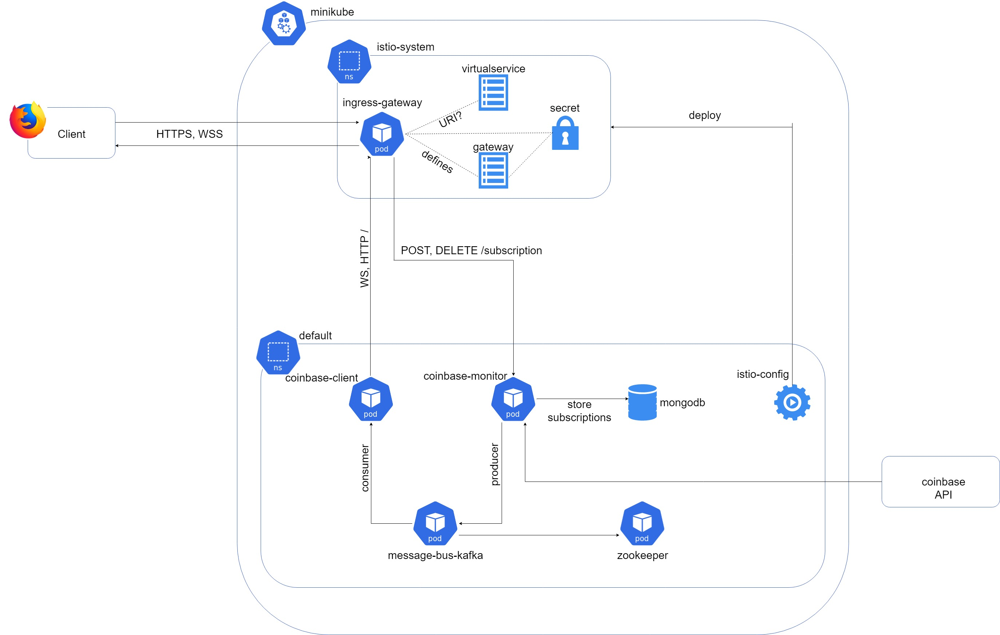

# Coinbase Monitor

coinbase-monitor is web application designed to monitor price fluctuations from Coinbase Pro service

## Requirements
Prerequisites for running this project:
- Docker
- Helm 3
- Minikube with [kvm2 driver](https://minikube.sigs.k8s.io/docs/drivers/kvm2/)
- Maven
- Java 11

## Getting Started
#### zookeeper
- Run from terminal: `eval $(minikube docker-env)`
- Continue using this terminal
- In directory coinbase-monitor-release/zookeeper/build: `./build-script --package-helm-chart`
- Deploy application: `helm install --namespace=default --generate-name <generated_chart_from_build_script>`

#### message-bus-kafka
- Run from terminal: `eval $(minikube docker-env)`
- Continue using this terminal
- In directory coinbase-monitor-release/message-bus-kafka/build: `./build-script --package-helm-chart`
- Deploy application: `helm install --namespace=default --generate-name <generated_chart_from_build_script>`

#### mongo
- Run from terminal: `eval $(minikube docker-env)`
- Continue using this terminal
- In directory coinbase-monitor-release/mongo/build: `./build-script --package-helm-chart`
- Deploy application: `helm install --namespace=default --generate-name <generated_chart_from_build_script>`

#### istio-config
- Run from terminal: `eval $(minikube docker-env)`
- Continue using this terminal
- In directory coinbase-monitor-release/istio-config/build: `./build-script -bv --package-helm-chart`
- Deploy application: `helm install --namespace=default --generate-name <generated_chart_from_build_script>`

#### coinbase-monitor
- Run from terminal: `eval $(minikube docker-env)`
- Continue using this terminal
- In directory coinbase-monitor-release/coinbase-monitor: `mvn clean install`
- In directory coinbase-monitor-release/coinbase-monitor/build: `./build-script -bv --package-helm-chart`
- Deploy application: `helm install --namespace=default --generate-name <generated_chart_from_build_script>`

#### coinbase-client
- Run from terminal: `eval $(minikube docker-env)`
- Continue using this terminal
- In directory coinbase-monitor-release/coinbase-client: `mvn clean install`
- In directory coinbase-monitor-release/coinbase-client/build: `./build-script -bv --package-helm-chart`
- Deploy application: `helm install --namespace=default --generate-name <generated_chart_from_build_script>`

### How to use:
- Open terminal and run: `minikube tunnel`. This is blocking terminal so leave it and open another to continue.
- To find IP address where minikube is forwarding LoadBalancer istio-ingressgateway svc: `minikube service -n istio-system istio-ingressgateway --url`
- You need to use address and port mapped to 443
- Find out which port is mapped 443 `kubectl get svc -n istio-system | grep ingressgateway`
- Example output: `http://192.168.39.17:30659/`
- IMPORTANT: Istio is not upgrading this connection to HTTPS yet, so use `https://192.168.39.17:30659/`

#### Useful tips and links:
- [Minikube and istio](https://istio.io/latest/docs/setup/platform-setup/minikube/)
- `minikube config set driver kvm2`
- `minikube config set cpus 3`
- `minikube config set memory 8192`

## Documentation for Coinbase API Endpoints Version 1.0.0
No description provided (generated by Openapi Generator https://github.com/openapitools/openapi-generator)

*Automatically generated by the [OpenAPI Generator](https://openapi-generator.tech)* for source [CoinbasePro](https://docs.pro.coinbase.com/)

## Documentation for coinbase-client Endpoints Version 1.0.0

|   Request         |   Path                            |   Internal Destination        |   Protocol    |   Method  |   Description                                                 |
|-------------------|-----------------------------------|-------------------------------|---------------|-----------|---------------------------------------------------------------|
|   Index           |   /                               |   coinbase-client             | https         |   GET     |   Front page                                                  |
|   websocket       |   /websocket                      |   coinbase-client             | wss           |   -       |   SockJS base path                                            |
|   coinbase        |   /websocket/topic/coinbase       |   coinbase-client             | wss           |   -       |   Stomp endpoint for listening changes in price               |
|   webjars         |   /webjars                        |   coinbase-monitor            | https         |   GET     |   Get all external resources (css, js e.g. bootstrap, jquery) |
|   subscriptions   |   /subscription                   |   coinbase-monitor            | https         |   POST    |   Create new subscription for ticker channel (EUR or USD)     |
|   subscriptions   |   /subscription/{uuid}            |   coinbase-monitor            | https         |   DELETE  |   Delete subscription for given uuid (regex [A-Fa-f0-9]{64}$)

## Documentation for internal Endpoints Version 1.0.0
Not yet available. Planned to describe endpoints for internal services:
- Mongo (mongo-express container GUI Management)
- Zookeeper
- Message Bus Kafka

## Author
Ivan Viseslav Rebic

